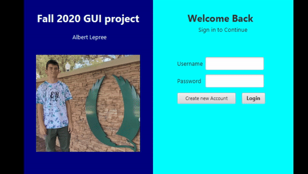
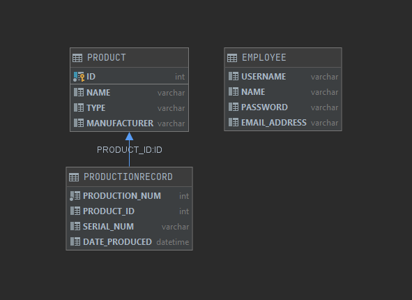
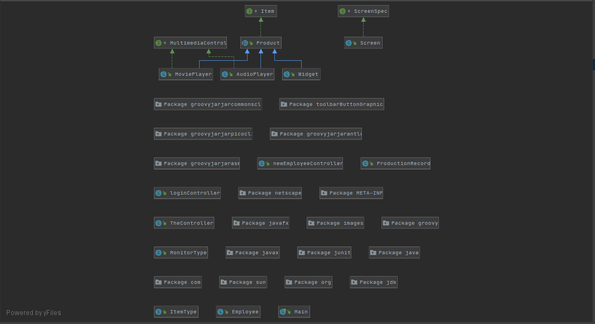

# Object Oriented GUI Project Using Gradle

I created this project in Fall 2020 during my Junior year of college at Florida Gulf Coast University. This project is intended to demonstrate a lot of key concepts
regarding object oriented programming, lambdas, mySQL databases, and much more. I made this project with my OOP class with professor Scott Vanselow. I 
had help from many sources and people including classmates and Teaching Assistants. Before doing this project I had a very basic understanding of the java programming
language and object oriented programming concepts. Additionally, before this project I had no experience with mySQL or databases of any kind. My professor encouraged
us to go ahead and try new things, so for the extent of this project I was 2+ weeks ahead almost the entire semester. Also, I added some optional functionality such
as a login screen. This was the most fun I have ever had programming in any class and I look forward the the assignments and projects that lie ahead.  

## Demonstration

 

## Documentation

[JavaDoc](https://xexima61.github.io/OOBGradleProject/docs/index-files/index.html)

## Diagrams

Database Diagram   
 
 
 Class Diagram  
 

## Getting Started

• RUN THE PROGRAM 
• Run -> Edit Configurations -> VM configurations -> paste the text below replacing the PathToYourJavaFXSDK with the path to your JavaFX SDK. You can find this through Windows Explorer (the folder icon). (no C: and forward slashes on a Mac)  
------------------------------------------------------------------------------------------------------------ 
--module-path "C:\PathToYourJavaFXSDK\lib" --add-modules javafx.controls,javafx.fxml,javafx.base,javafx.media,javafx.graphics,javafx.swing,javafx.web 
------------------------------------------------------------------------------------------------------------ 

## Built With

* Intellij Ultimate edition 
* Scene Builder  
* W3 schools MySQL guide 

## Contributing

I wrote this project completely on my own but I had very specific direction of how to build it from my professor. Additionally, I had help from my professor, the teaching assistants, and even some classmates when I got stuck in certain spots.

## Author

* Albert Finnegan Lepree

## License

Public repositories on GitHub are often used to share open source software. For your repository to truly be open source, you'll need to license it so that others are free to use, change, and distribute the software. https://help.github.com/articles/licensing-a-repository/  
You have the option to choose a license when you first create your repository.  
If you need to create a license for an existing repository...
1. Go to your repository.
2. Click on "Create new file" Button.
3. Type the file name as License.txt or License.md in the input box next to your repository name, a drop down button appears towards right side.
4. Choose the type of license of your choice.
5. Click "Commit new file" button at the bottom (Green button)
Credit https://stackoverflow.com/questions/31639059/how-to-add-license-to-an-existing-github-project  
To choose a license, see https://choosealicense.com/ 

## Acknowledgments

* W3 schools, stack overflow
* Tyler Krawec, Paul Sullivan, Jose Alvarez
* My professor and TAs 

## History

Information about what has changed. 

## Key Programming Concepts Utilized

This section would not necessarily be in a real README.   
It is a reference for you and a place to impress potential employers with your knowledge. 
Identify what concepts you utilize so when you need to use them again you will know that you will find them here. Include a brief description of the concepts in your own words to help you prepare for related interview questions. 
